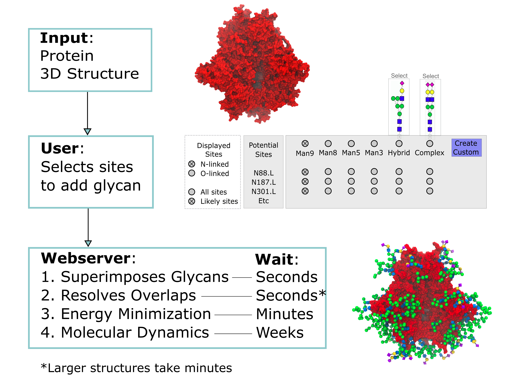

# GlycoProteinBuilder
Uses GMML2 to add and adapt 3D structures of N-glycans and O-glycans onto glycoproteins. It can do this for Asn, Ser, Thr and Tyr.

## General Concept

### Notes
Project is under development, contact olivercgrant "at" gmail.com with queries. 
This code is intended to replace the glycoprotein builder currently available on glycam.org/gp. You can compile and run it locally.
Has been tested on linux, but might install on both Mac and Windows.

### Prerequisites

You'll need GMML2: [Click here for installation instructions](https://github.com/GLYCAM-Web/gmml2#readme)

### Installation of GlycoProteinBuilder
The GlycoproteinBuilder will be compiled to gmml2/bin/gpBuilder after running the gmml2 make.sh script

### Testing
Once compiled, a sample call to the program can look as follows

    cd gmml2/tests
    mkdir output
    ../bin/gpBuilder tests/inputs/017.GlycoproteinBuilderInput.txt output

### Setup
Edit or create an input.txt file. See gmml2/tests/tests/inputs/017.GlycoproteinBuilderInput.txt for an example.

Required input:

    A protein 3D structure
    A Glycan 3D structure(s) or sequences in GLYCAM condensed nomenclature (just like the carb builder here: glycam.org/cb)
    An input.txt, which contains:
        protein file name
        the protein residue numbers you want to attach to (no automatic detection of sequons)
        the glycan you want to attach in Glycam condensed sequence format.

Optional input : default values
* NumberOfOutputStructures:1 -> each output structure is an independent sample, where shapes of glycans at each site are randomized according to their statistical likelihood. 
* persistCycles:5 -> how long the algorithm keeps trying to find an improvement in overlap. A higher value takes more time, but may better resolve overlaps.
* seed:0 -> any number will yield a different result from other numbers, but will be reproducible across multiple runs. Delete this line for true randomness
* freezeGlycositeResidueConformation:false -> if true, chi1 and chi2 angles of protein-glycan linkages will be preserved according to their shape in the protein file
* deleteIncompatibleSites:false -> if true, algorithm will delete glycans where overlaps fail to resolve one at a time and start over, until all overlaps can be resolved. If false, all glycans will be preserved in each sample, even if the resulting structure has overlaps
