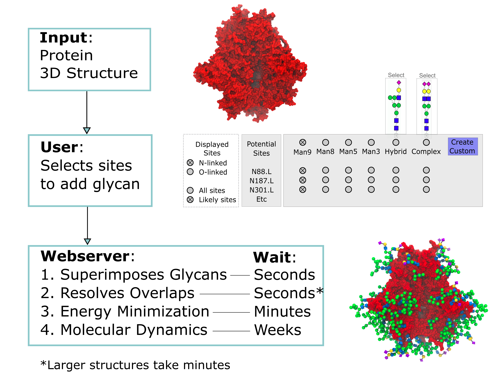

# Glycoprotein Builder
Uses GMML2 to add and adapt 3D structures of N-glycans and O-glycans onto glycoproteins. It can do this for Asn, Ser, Thr and Tyr.

## General Concept


### Notes
Project is under development, contact olivercgrant "at" gmail.com with queries. 
This code is intended to replace the glycoprotein builder currently available on glycam.org/gp. You can compile and run it locally.
Only tested on Linux.

### Prerequisites

You'll need GMML2: [Click here for installation instructions](https://github.com/GLYCAM-Web/gmml2#readme)

### Installation
The Glycoprotein Builder will be compiled to gmml2/bin/glycoproteinBuilder after running the gmml2 make.sh script

### Testing
Once compiled, a call to the program can look as follows
```
./bin/glycoproteinBuilder inputFile.txt outputDir
```
Or using a test input file
```
cd gmml2/tests
../bin/glycoproteinBuilder inputs/017.GlycoproteinBuilderInput.txt outputDir
```

You can run `./bin/glycoproteinBuilder --help` for a list of options

```
usage: ./bin/glycoproteinBuilder [-h | --help]
                                 [-v | --version]
                                 [-t <value> | --num-threads <value>]
                                 [--overwrite-existing-files]
                                 input-file
                                 [output-directory]
```

### Output
The output comes in 3 parts:
* default: The complete glycoprotein structure with overlaps resolved. Glycans are kept as close to their default shape as possible.
* unresolved: The complete glycoprotein with all glycans in their default shape, but without overlaps resolved.
* samples: Zero or more structures in a wide variety of shapes with overlaps resolved. Sampled according to statistical likelihood.

In addition to a summary detailing the settings used and output structures, as well as a structures.csv containing only structure data.

### Input

First, you may want to get an overview of all potential glycosylation sites
```
./bin/glycosylationSiteFinder protein.pdb --format txt
```
Or save it as a csv
```
./bin/glycosylationSiteFinder protein.pdb --format csv > glycosites.csv
```

Then, edit or create an input.txt file. See [example.txt](../../tests/inputs/017.GlycoproteinBuilder/example.txt) for an example.

Required input:
```
A protein 3D structure in .pdb format
An input.txt, containing:
  Protein: file name of the protein structure

  ProteinResidue, GlycanName:
  protein residue number | glycan sequence
  ...
  protein residue number | glycan sequence
  END

Any number of protein residues | glycan pairs can be entered
Glycans are defined in Glycam condensed sequence format (see the carb builder here: glycam.org/cb)
```

Additional settings:

| Setting  | Default | Explanation |
| --- | --- | --- |
| numberOfSamples | 1 | Number of structure samples to create in addition to the default structure |
| persistCycles | 5 | How long the algorithm persists in looking for a solution with a lower number of overlaps. Higher values take more time, but may yield better results |
| rngSeed | random | The random number generator used in the algorithm will pick a random starting point by default, the value of which will be written into the output summary. Alternatively, a specific integer such as rngSeed:42 can be provided in order to exactly reproduce the output of another run with the same seed and settings. Multithreading does not hinder reproducibility |
| prepareForMD | false | Recommended and likely necessary if you wish to run an energy minimization or MD simulation. OFF files will be created for each output structure when this option is turned on |
| overlapRejectionThreshold | 0.0 | The algorithm will attempt to keep the Lennard-Jones repulsive potential of all glycan atoms equal to or lower than this value. Samples where this failed will be placed in a /rejected directory |
| useInitialGlycositeResidueConformation | false | Enable to preserve chi1 and chi2 angles of protein-glycan linkages according to their initial shape |
| moveOverlappingSidechains | false | Enable to adjust protein sidechains from their initial shape if and only if it allows for reduced glycan overlap or a greater range of glycan shapes |
| deleteUnresolvableGlycosites | false | Enable to delete glycans in samples where the overlap rejection threshold is exceeded in order to produce a structure with no overlaps. Structures with deleted sites will be placed in a /deletions directory. Glycans will not be deleted in the default structure |
| ignoreHydrogen | false | Whether glycan hydrogen atoms are included in overlap checks or not |
